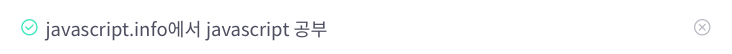
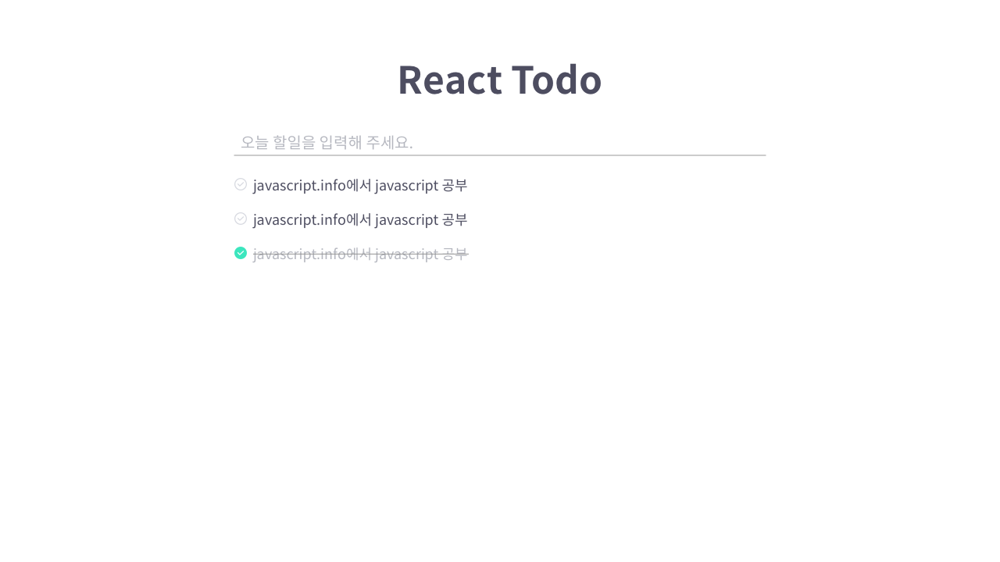

# 과제 설명

CRA로 만들어진 간단한 TODO 앱입니다. 아직 스타일과 뼈대만 만들어진 상태입니다. 아래 요구하는 내용을 잘 읽어주시고 요구 사항을 구현해 주세요.

## 수행 기술

- React, Typescript, Javascript
- 설치되어있는 모듈(node_modules) 외에 다른 외부 라이브러리는 사용하지 않도록 합니다.
- 패키지 매니저로 `yarn`을 사용하고 있습니다. 가급적이면 `yarn`을 사용해 주세요.

## 시작 하기

1. `git init`
2. `yarn install`
3. `yarn run start`

# 요구사항

- **참고** 요구사항의 순서는 난이도와 상관이 없음
- `[Optional]`로 시작하는 요구사항은 반드시 구현해야 하는 사항이 아닙니다.

1. 현재 App.tsx파일안에 모든 컴포넌트가 포함돼 있습니다. 적절한 구조로 컴포넌트를 나눠주세요.

   - Class component로 작성해도 괜찮지만 가능하면 Functional component로 작성해 주세요.
   - `[Optional]` PropsTypes보다 Typescript로 props의 타입을 정의해 주세요.

2. 오늘 할 일을 추가할 수 있는 기능을 구현해 주세요.

   - 할 일 텍스트를 입력하고 엔터키를 누르면 Todo list에 추가되도록 해주세요.
   - 할 일 텍스트를 입력하지 않았을 때 사용자에게 빈값을 입력할 수 없다고 알려주세요.
     - 방법은 편하신 방법 아무거나 사용해도 괜찮습니다.

3. 할 일을 완료했을 때 체크 할 수 있는 기능을 구현해주세요.

   - 체크 아이콘 또는 할 일 텍스트를 클릭했을 때 UI가 아래와 같이 변경될 수 있도록 구현해 주세요.
     - 체크 아이콘 변경
     - 텍스트에 취소선 추가
   - Before Checked
     
   - After Checked
     

4. 할 일에 마우스를 호버 했을 때 UI가 변경되도록 구현해 주세요.

   - 체크 아이콘 색상 변경
   - 삭제 아이콘 보여 주기
   - Before Hover
     
   - After Hover
     

5. 할 일을 삭제하는 기능을 구현해 주세요.

   - 삭제 아이콘을 클릭했을 때 클릭한 할 일이 삭제돼야 합니다.
   - 삭제 아이콘이 화면에 안 보일 때는 클릭 할 수 없게 해주세요.

6. 사용자가 작성한 할 일을 탭을 껏다 키더라도 다시 확인 할 수 있게 해주세요.

   - Web Storage API를 활용해 사용자의 정보가 저장 될 수 있도록 구현해 주세요.
   - `[Optional]` 가능하면 해당 로직을 Custom hook이나 javascript 모듈로 작성해 재사용 할 수 있게 만들어 주세요.

7. Drag & Drop으로 사용자가 할일의 순서를 변경할 수 있게해주세요.

8. `[Optional]` CSS 관련 (**아래 내용은 구현하지 않으셔도 괜찮습니다.**)

   - 해당 프로젝트는 680px이상 화면에서만 정상적으로 사용할 수 있습니다. 더 작은 모바일 환경에서도 사용할 수 있도록 CSS를 수정해 주세요.
   - CSS 파일이 `index.css` 한 파일에 모두 작성되어 있습니다. 이를 `styled-components`를 활용해 컴포넌트 별로 분리해 주세요.
     - `styled-components`는 설치되어 있습니다.

9. `[Optional]` 가능하면 하나의 커밋보다 잘 나눠진 커밋으로 만들어 주세요.

# 결과물 이미지

